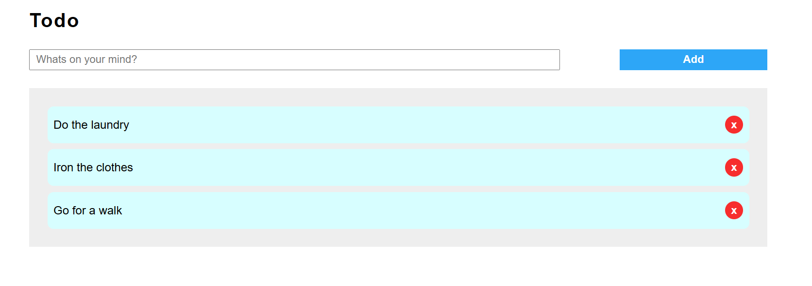

# Todo App

This is a simple Todo application built with React that allows users to add and remove tasks from a list. The app consists of individual components including `List`, `Todo`, and `Form`.

## Features
- Add new todos
- Remove existing todos
- Simple and clean UI

## Components

### 1. Form
- A text input field where users can enter their todo item.
- An `Add` button to submit the todo to the list.

### 2. Todo
- Displays individual todo items with text.
- Includes a delete button to remove the todo.

### 3. List
- Renders a list of todo items.
- Uses the `Todo` component to display each item.

## Installation

1. Clone the repository:
   ```sh
   git clone https://github.com/your-username/todo-app.git
   ```
2. Navigate to the project directory:
   ```sh
   cd todo-app
   ```
3. Install dependencies:
   ```sh
   npm install
   ```
4. Start the application:
   ```sh
   npm start
   ```

## Usage
- Enter a task in the input field and click the `Add` button.
- The task will be added to the list.
- Click the red delete button next to a task to remove it from the list.

## Screenshot
![Todo App]

## License
This project is open-source and available under the [MIT License](LICENSE).

